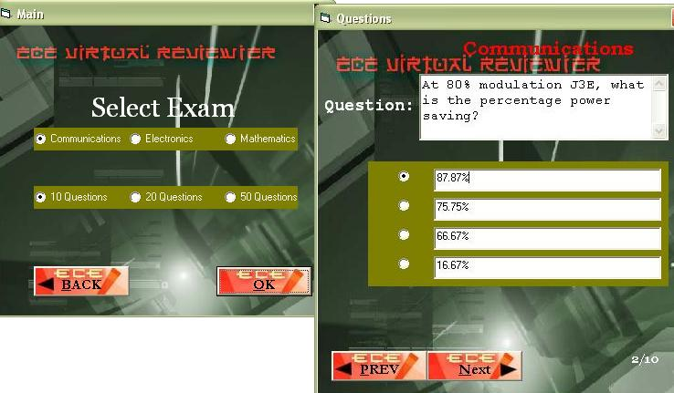



## ECE Reviewer

### Description

Database! Reviewer for exams! It uses randomize for questions and answers, and calculate percentages for correct answers. could be useful for quizzes.
 
### More Info
 

             |
---                |---
**Submitted On**   |2006-03-24 11:14:54
**By**             |[audiobreather](https://github.com/Planet-Source-Code/PSCIndex/blob/master/ByAuthor/audiobreather.md)
**Level**          |Beginner
**User Rating**    |4.9 (39 globes from 8 users)
**Compatibility**  |VB 6\.0
**Category**       |[Databases/ Data Access/ DAO/ ADO](https://github.com/Planet-Source-Code/PSCIndex/blob/master/ByCategory/databases-data-access-dao-ado__1-6.md)
**World**          |[Visual Basic](https://github.com/Planet-Source-Code/PSCIndex/blob/master/ByWorld/visual-basic.md)
**Archive File**   |[ECE\_Review1983133262006\.zip](https://github.com/Planet-Source-Code/audiobreather-ece-reviewer__1-64651/archive/master.zip)

